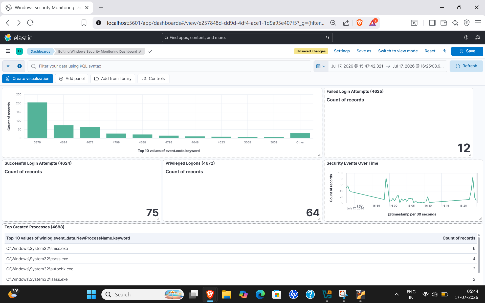
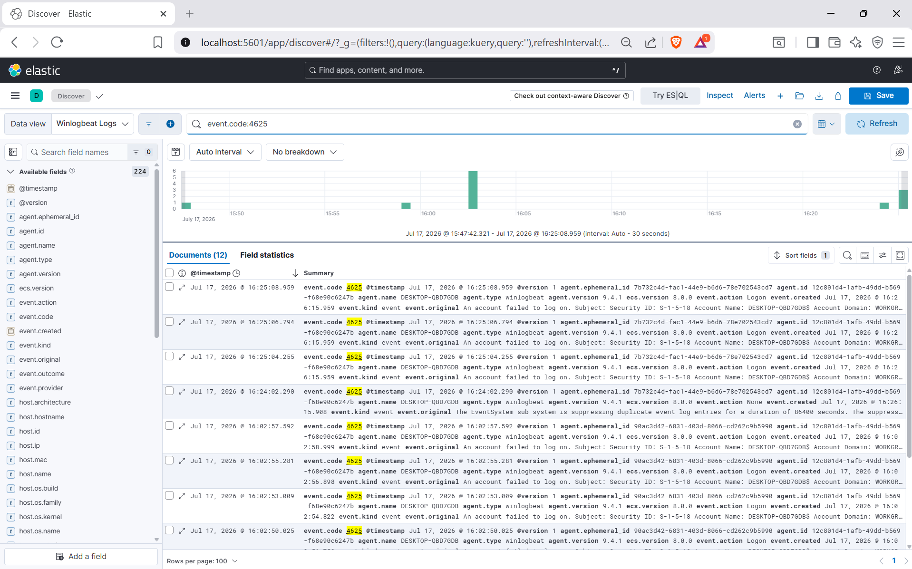
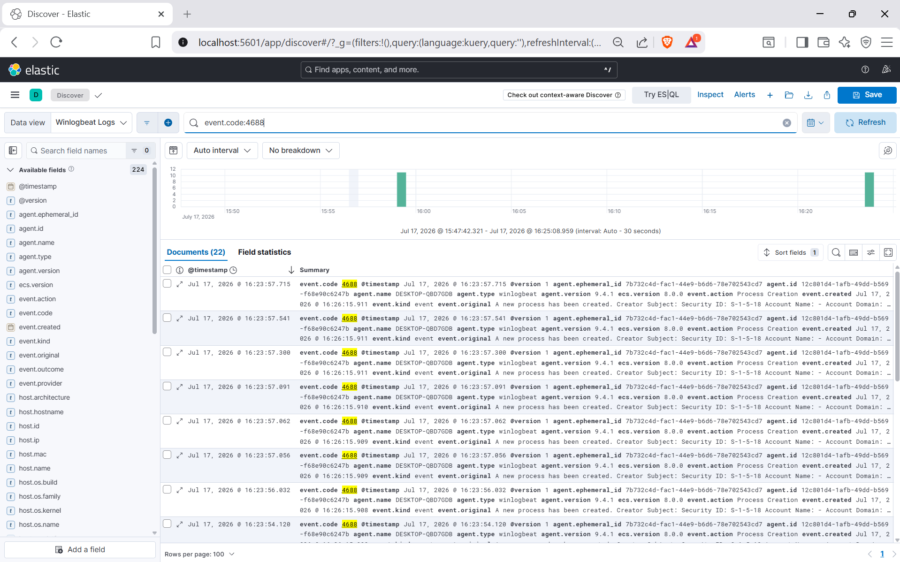

# 🛡️ Windows Security Monitoring and Threat Detection using ELK Stack

A Security Information and Event Management (SIEM) project built using the ELK Stack (Elasticsearch, Logstash and Kibana) to collect, analyze and visualize Windows Security Event Logs in real time.

---

## 📌 Project Overview

This project demonstrates how the ELK Stack can be used to centralize Windows event logs and create dashboards for security monitoring. Winlogbeat forwards Windows Security logs to Logstash, which processes them and stores them in Elasticsearch. Kibana is then used to visualize important security events.

---

## 🚀 Features

- Centralized Windows Event Log collection
- Real-time log analysis
- Interactive Kibana dashboards
- Security event visualization
- Detection of successful logins
- Detection of failed login attempts
- Monitoring privileged logons
- Monitoring process creation events
- Time-based event monitoring

---

## 🛠️ Technologies Used

- Elasticsearch
- Logstash
- Kibana
- Winlogbeat
- Ubuntu Linux
- Windows 10
- VirtualBox

---

## 📊 Security Events Monitored

| Event ID | Description |
|----------|-------------|
| 4624 | Successful Login |
| 4625 | Failed Login |
| 4672 | Privileged Logon |
| 4688 | Process Creation |

---

## 📷 Dashboard Preview

### Windows Security Dashboard

### Failed Login Events (4625)

### Process Creation Events (4688)

---

## 📄 Project Report

The complete project documentation is available in:

**SIEM_Project_Report.pdf**

---

## 🔮 Future Improvements

- Alerting using Kibana Rules
- Email notifications
- Machine Learning anomaly detection
- Wazuh integration
- Additional Windows Event IDs
- Linux log monitoring

---

## 👨‍💻 Author

**Shubham Mahato**

B.Tech, Food Engineering and Technology  
Birla Institute of Technology, Mesra

---

⭐ If you found this project useful, feel free to star the repository.
